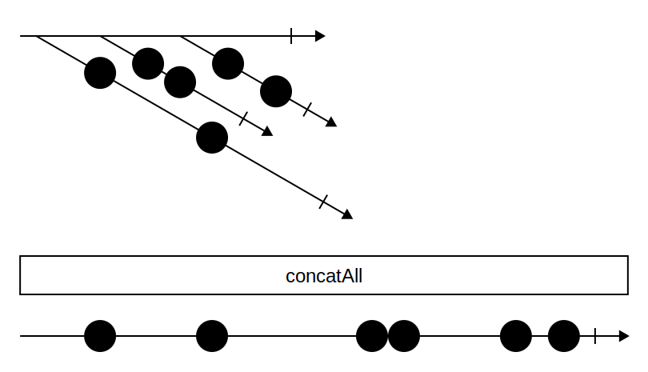

# Swirly

A marble diagram generator.



## Installation

```bash
npm install -g swirly
```

## Usage

```bash
swirly input.yml output.svg
```

## Author

[Tim De Pauw](https://tmdpw.eu/)

## License

MIT
