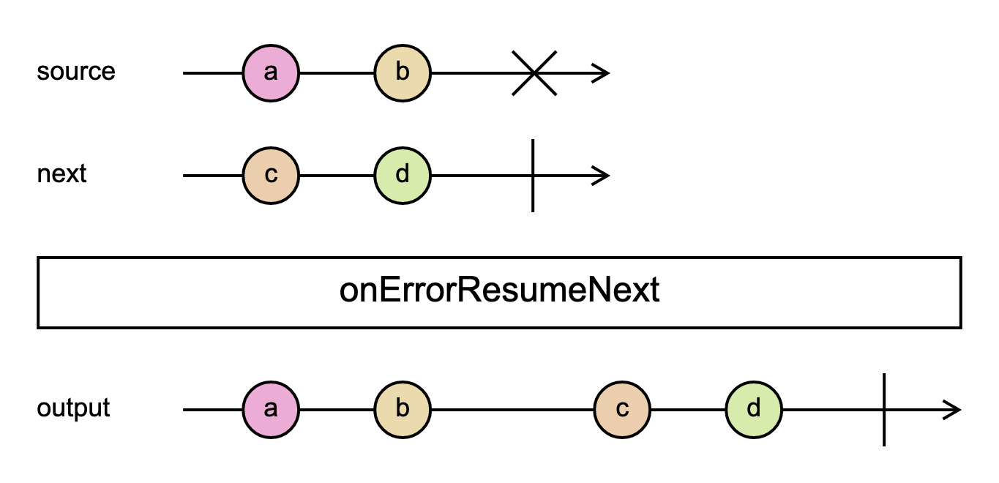
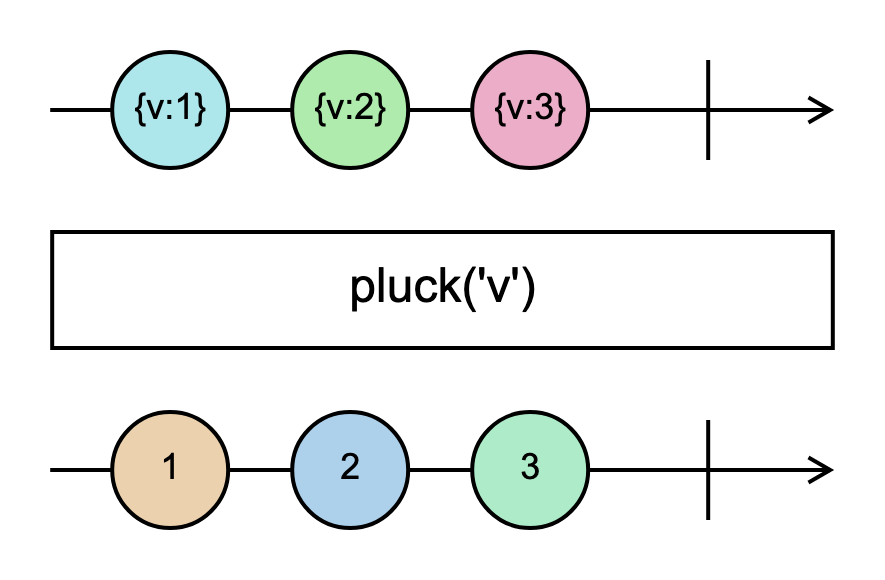
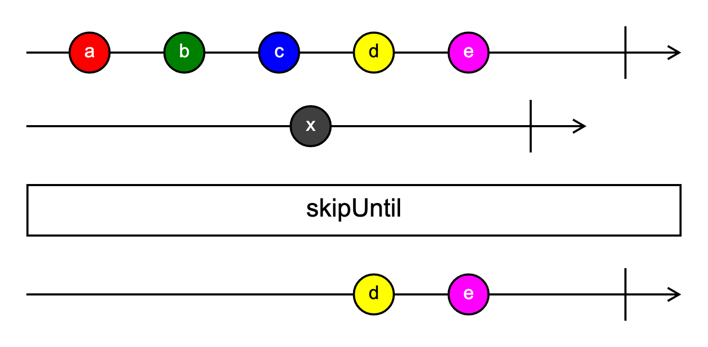
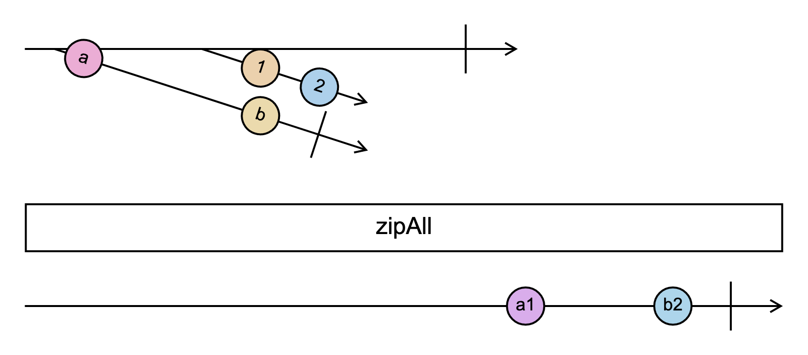

# Examples

## concatAll

[Spec](examples/concatAll.txt)
·
[PNG](examples/concatAll.png)
·
[SVG](examples/concatAll.svg)


```
% An example application of the concatAll operator.
% Showcases styles and higher-order observables.
% Based on RxJS's concatAll diagram:
% https://github.com/ReactiveX/rxjs/blob/fc3d4264395d88887cae1df2de1b931964f3e684/spec/operators/concatAll-spec.ts

[styles]
frame_width = 20
completion_height = 20
higher_order_angle = 30
arrow_fill_color = black

x = ----a------b------|

y = ---c-d---|

z = ---e--f-|

-x---y----z------|

> concatAll

-----a------b---------c-d------e--f-|
```

## debounce

[Spec](examples/debounce.txt)
·
[PNG](examples/debounce.png)
·
[SVG](examples/debounce.svg)


```
% An example application of the debounce operator.
% Showcases marble diagrams inside operators.
% Based on RxJS's debounce diagram:
% https://github.com/ReactiveX/rxjs/blob/fc3d4264395d88887cae1df2de1b931964f3e684/spec/operators/debounce-spec.ts

-a--bc--d---|

> debounce(() => `--|`)

---a---c--d-|
```

## exhaustAll

[Spec](examples/exhaustAll.txt)
·
[PNG](examples/exhaustAll.png)
·
[SVG](examples/exhaustAll.svg)


```
% An example application of the exhaustAll operator.
% Showcases ghost notifications.

x = --a---b---c--|

y = ---d--e---f---|

z = ---g--h---i---|

------x-------y------z--|
ghosts = y

> exhaustAll

--------a---b---c-------g--h---i---|
```

## onErrorResumeNext

[Spec](examples/onErrorResumeNext.txt)
·
[PNG](examples/onErrorResumeNext.png)
·
[SVG](examples/onErrorResumeNext.svg)



```
% An example application of the onErrorResumeNext operator.
% Showcases titles and error notifications.
% Based on RxJS's onErrorResumeNext diagram:
% https://github.com/ReactiveX/rxjs/blob/86dfe3c78dd37c6828a08b45364f030796879cc0/spec/operators/onErrorResumeNext-spec.ts

--a--b--#
title = source

--c--d--|
title = next

> onErrorResumeNext

--a--b----c--d--|
title = output
```

## pluck

[Spec](examples/pluck.txt)
·
[PNG](examples/pluck.png)
·
[SVG](examples/pluck.svg)



```
% An example application of the pluck operator.
% Showcases styles and notification values.
% Based on RxJS's pluck diagram:
% https://github.com/ReactiveX/rxjs/blob/fc3d4264395d88887cae1df2de1b931964f3e684/spec/operators/pluck-spec.ts

[styles]
event_radius = 30
operator_height = 60

--a--b--c--|
a := {v:1}
b := {v:2}
c := {v:3}

> pluck('v')

--x--y--z--|
x := 1
y := 2
z := 3
```

## skipUntil

[Spec](examples/skipUntil.txt)
·
[PNG](examples/skipUntil.png)
·
[SVG](examples/skipUntil.svg)



```
% An example application of the skipUntil operator.
% Showcases notification-level styling.
% Based on RxJS's skipUntil diagram:
% https://github.com/ReactiveX/rxjs/blob/fc3d4264395d88887cae1df2de1b931964f3e684/spec/operators/skipUntil-spec.ts

[styles]
event_value_color = white

[styles.a]
fill_color = #FF0000

[styles.b]
fill_color = green

[styles.c]
fill_color = rgb(0, 0, 255)

[styles.d]
fill_color = yellow
value_color = black

[styles.e]
fill_color = magenta

[styles.x]
fill_color = rgb(63, 63, 63)

--a--b--c--d--e----|

---------x------|

> skipUntil

-----------d--e----|
```

## zipAll

[Spec](examples/zipAll.txt)
·
[PNG](examples/zipAll.png)
·
[SVG](examples/zipAll.svg)



```
% An example application of the zipAll operator.
% Based on RxJS's zipAll diagram:
% https://github.com/ReactiveX/rxjs/blob/fc3d4264395d88887cae1df2de1b931964f3e684/spec/operators/zipAll-spec.ts

x = -a-----b-|

y = --1-2-----

-x----y--------|

> zipAll

-----------------A----B-|
A := a1
B := b2
```

